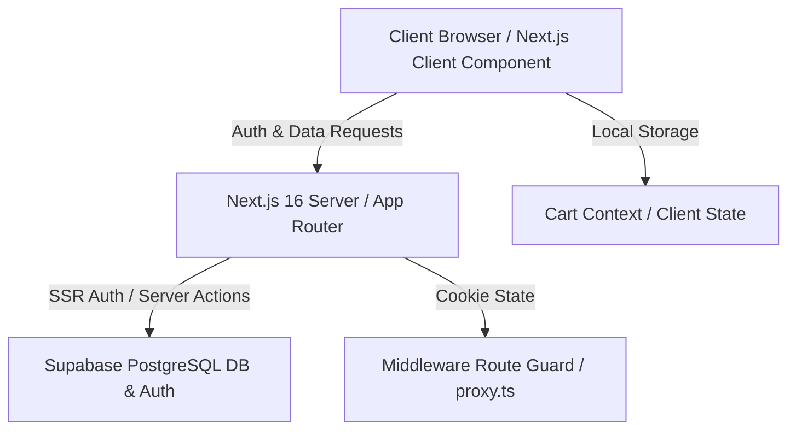

# รายงานสรุปโครงการ Icon Multimedia (IT & Computer Store)
**ฉบับสมบูรณ์ (Comprehensive Project Report)**

รายงานฉบับนี้จัดทำขึ้นเพื่อสรุปโครงสร้างสถาปัตยกรรม ฟังก์ชันการทำงาน โครงสร้างฐานข้อมูล รายละเอียดไฟล์สำคัญ และความคืบหน้าของโปรเจกต์ระบบร้านค้าไอทีออนไลน์ **Icon Multimedia** ซึ่งพัฒนาด้วย Next.js 16, React 19 และ Supabase

---

## 1. ภาพรวมของโครงการ (Project Overview)
**Icon Multimedia** เป็นระบบร้านค้าออนไลน์ (E-Commerce) สำหรับจัดจำหน่ายอุปกรณ์ไอทีและคอมพิวเตอร์ (เช่น Laptops, Desktops, PC Components, Accessories, External Devices และ Printers) โดยรองรับระบบงาน 2 ส่วนหลัก:
1. **ส่วนหน้าร้านสำหรับลูกค้า (Storefront):** ค้นหาสินค้า, แยกหมวดหมู่, ดูรายละเอียดสินค้าและสเปก, เพิ่มสินค้าลงตะกร้าแบบ Real-time, สั่งซื้อสินค้า (Checkout), และติดตามสถานะคำสั่งซื้อ
2. **ส่วนหลังบ้านสำหรับผู้ดูแลระบบ (Admin Panel):** แผงควบคุมสถิติภาพรวม (Dashboard Overview), การจัดการสินค้า (เพิ่ม, แก้ไข, ลบ), การจัดการและปรับสถานะใบสั่งซื้อ (Orders), และการจัดการระดับสิทธิ์ผู้ใช้งาน (Users & Roles)

---

## 2. สถาปัตยกรรมเทคโนโลยี (Technical Architecture)

โครงการนี้สร้างขึ้นโดยใช้โครงสร้างเว็บสมัยใหม่ที่มีประสิทธิภาพสูงและความปลอดภัยสูงสุด:

*   **Frontend Framework:** Next.js 16 (App Router) และ React 19
*   **Styling:** Tailwind CSS 4 สำหรับการทำ UI/UX ที่ทันสมัย รองรับทั้ง Light และ Dark mode (พร้อมดีไซน์ระดับพรีเมียมและ Glassmorphism)
*   **Database & Authentication:** Supabase (PostgreSQL)
*   **Server-Side Rendering (SSR) & Security:** `@supabase/ssr` สำหรับสร้าง Server Client เพื่อดึงข้อมูลและทำ Auth Guards ผ่านระบบ Cookie
*   **State Management:**
    *   **Cart Context:** จัดการตะกร้าสินค้าฝั่ง Client และเชื่อมข้อมูลกับ `localStorage` โดยอัตโนมัติ
    *   **Toast Context:** ระบบแจ้งเตือน (Popup notifications) บนหน้าจอเมื่อมีการตอบสนองจากผู้ใช้
    *   **Auth Context:** ตรวจสอบสถานะการล็อกอินและสิทธิ์ (Role) ของผู้ใช้งานจากฝั่ง Client

---

## 3. โครงสร้างฐานข้อมูล (Database Schema)

ระบบใช้งานตารางบนฐานข้อมูล Supabase ทั้งหมด 3 ตารางหลัก ดังนี้:

### 3.1 ตารางสินค้า (`products`)
เก็บข้อมูลสินค้าทั้งหมดในระบบ รวมถึงฟิลด์สเปกแบบยืดหยุ่นด้วย JSONB
*   `id` (TEXT, Primary Key): รหัสสินค้า
*   `name` (TEXT, Not Null): ชื่อสินค้า
*   `slug` (TEXT, Unique, Not Null): URL Slug ของสินค้า
*   `description` (TEXT): รายละเอียดสินค้า
*   `price` (NUMERIC, Not Null): ราคาสินค้าที่ขายจริง
*   `original_price` (NUMERIC): ราคาตั้งต้น (สำหรับแสดงส่วนลด)
*   `image` (TEXT): ลิงก์รูปภาพสินค้า
*   `category` (TEXT, Not Null): หมวดหมู่สินค้า (เช่น laptops, desktops, components)
*   `in_stock` (BOOLEAN, Default: true): สถานะมีสินค้า
*   `stock` (INTEGER, Default: 0): จำนวนสินค้าในคลัง
*   `rating` (NUMERIC, Default: 0): คะแนนเฉลี่ยรีวิวสินค้า
*   `reviews` (INTEGER, Default: 0): จำนวนคนรีวิว
*   `specs` (JSONB): ข้อมูลสเปกสินค้าเชิงลึก (Key-Value)
*   `created_at` / `updated_at` (TIMESTAMPTZ)

### 3.2 ตารางคำสั่งซื้อ (`orders`)
เก็บข้อมูลคำสั่งซื้อและรายการสินค้าที่สั่งซื้อแบบ JSONB
*   `id` (UUID, Primary Key, Default: gen_random_uuid())
*   `user_id` (UUID, Foreign Key -> auth.users)
*   `items` (JSONB): รายการสินค้าที่สั่งซื้อ (โครงสร้าง `OrderItem[]` ประกอบด้วย productId, name, price, quantity, image)
*   `total_amount` (NUMERIC, Not Null): ยอดเงินสุทธิ
*   `status` (TEXT, Default: 'pending'): สถานะออเดอร์ (`pending` | `processing` | `completed` | `cancelled`)
*   `shipping_address` (JSONB): ข้อมูลที่อยู่จัดส่ง (fullName, address, city, province, postalCode, phone)
*   `created_at` / `updated_at` (TIMESTAMPTZ)

### 3.3 ตารางผู้ใช้งานในระบบ (`users`)
เก็บข้อมูลโปรไฟล์ผู้ใช้งานและบทบาทหน้าที่เพื่อตรวจสอบสิทธิ์เข้าหน้าแอดมิน
*   `id` (UUID, Primary Key -> auth.users.id)
*   `email` (TEXT)
*   `full_name` (TEXT)
*   `role` (TEXT, Default: 'user'): ระดับสิทธิ์ผู้ใช้ (`user` | `admin`)
*   `created_at` (TIMESTAMPTZ)

---

## 4. รายละเอียดฟังก์ชันและโครงสร้างโค้ดหลัก (Module Breakdown)

### 4.1 ระบบจัดการสิทธิ์และการป้องกันหน้าเว็บ (Authentication & Authorization)
*   **โค้ดสิทธิ์และการตั้งค่า Client/Server:**
    *   [utils/supabase/client.ts](file:///d:/test1/iconmultimedia/utils/supabase/client.ts) - ตัวเชื่อมต่อฝั่ง Browser Client
    *   [utils/supabase/server.ts](file:///d:/test1/iconmultimedia/utils/supabase/server.ts) - ตัวเชื่อมต่อฝั่ง Server Component (จัดการ Cookie)
    *   [lib/supabase/auth-context.tsx](file:///d:/test1/iconmultimedia/lib/supabase/auth-context.tsx) - คอนเท็กซ์ดักจับและส่งผ่านค่าผู้ใช้งาน
*   **ระบบ Route Guard (Middleware Proxy):**
    *   [proxy.ts](file:///d:/test1/iconmultimedia/proxy.ts) - คอยสกัดและตรวจสอบ Session ทุกครั้งที่ผู้ใช้เข้าถึงเส้นทางต่างๆ:
        *   **Protected Routes:** `/checkout`, `/profile`, `/orders` (หากไม่ล็อกอิน จะถูกส่งไปหน้า `/login`)
        *   **Admin Routes:** `/admin` (ต้องล็อกอินและมีสิทธิ์ `role === 'admin'` เท่านั้น หากไม่ใช่จะดีดกลับไปหน้าหลัก `/`)

### 4.2 ระบบหน้าร้านค้าออนไลน์ (Storefront Pages)
*   **หน้าหลัก (Homepage) - [app/page.tsx](file:///d:/test1/iconmultimedia/app/page.tsx):** 
    *   มี [HeroBanner.tsx](file:///d:/test1/iconmultimedia/components/home/HeroBanner.tsx) แสดงส่วนหัวพรีเมียม
    *   มี [CategoryGrid.tsx](file:///d:/test1/iconmultimedia/components/home/CategoryGrid.tsx) แสดงหมวดหมู่สินค้า
    *   ดึงข้อมูลสินค้าจริงจากตาราง Supabase แสดงในโซน **New Arrivals** และ **Best Sellers**
*   **หน้าร้านค้า (Shop catalog) - [app/shop/page.tsx](file:///d:/test1/iconmultimedia/app/shop/page.tsx):**
    *   เรียกใช้งาน [ShopClient.tsx](file:///d:/test1/iconmultimedia/app/shop/ShopClient.tsx) เพื่อคัดกรองข้อมูลด้วย URL Query parameter (ระบบค้นหา, ตัวกรองหมวดหมู่, ตัวกรองสินค้าที่มีในสต็อก และตัวจัดเรียงลำดับราคา/ความนิยม)
*   **หน้าหมวดหมู่เฉพาะสินค้า (Category Page) - [app/category/[slug]/page.tsx](file:///d:/test1/iconmultimedia/app/category/%5Bslug%5D/page.tsx):**
    *   แสดงผลการ์ดสินค้าแยกเฉพาะตามประเภทของไอดีประเภทสินค้า (Laptops, Components ฯลฯ)
*   **หน้ารายละเอียดสินค้า (Product Detail) - [app/product/[id]/page.tsx](file:///d:/test1/iconmultimedia/app/product/%5Bid%5D/page.tsx):**
    *   แสดงรายละเอียดสินค้าพร้อมการทำตารางสเปกและแนะนำสินค้าชนิดเดียวกันด้านล่างผ่าน [ProductDetailClient.tsx](file:///d:/test1/iconmultimedia/app/product/%5Bid%5D/ProductDetailClient.tsx)
*   **การ์ดสินค้า (Product Card Component) - [ProductCard.tsx](file:///d:/test1/iconmultimedia/components/home/ProductCard.tsx):**
    *   ปรับปรุงล่าสุดเพื่อรองรับการดึงรูปภาพของ Next.js Image Optimization ป้องกันสัดส่วนภาพบิดเบี้ยว (`object-contain`)

### 4.3 ระบบตะกร้าสินค้า (Client Shopping Cart State)
*   ตั้งอยู่ที่ [lib/cart/cart-context.tsx](file:///d:/test1/iconmultimedia/lib/cart/cart-context.tsx)
*   ใช้ `useReducer` ในการคำนวณราคาสุทธิ จำนวนสินค้า จัดการการเพิ่ม (Add), ลบ (Remove), อัปเดตจำนวนสินค้า (Update Quantity) และเคลียร์ตะกร้าทั้งหมด
*   ข้อมูลจะอัปเดตลง `localStorage` อัตโนมัติ ทำให้สินค้าในตะกร้าไม่หายไปแม้ผู้ใช้จะปิดหรือรีเฟรชบราวเซอร์

### 4.4 แผงควบคุมระบบจัดการแอดมิน (Admin Control Panel)
*   **การออกแบบเมนู - [app/admin/layout.tsx](file:///d:/test1/iconmultimedia/app/admin/layout.tsx):** จัดทำ Sidebar พรีเมียม สีเขียวมรกต (Emerald) เมนูแยกเป็นสัดส่วนชัดเจน
*   **หน้าภาพรวมแอดมิน (Overview Dashboard) - [app/admin/page.tsx](file:///d:/test1/iconmultimedia/app/admin/page.tsx):**
    *   คำนวณและแสดงผลตัวชี้วัด (KPIs): ยอดขายสะสมทั้งหมด (จากคำสั่งซื้อที่จัดส่งเสร็จสิ้น `completed`), จำนวนใบสั่งซื้อทั้งหมด, จำนวนสินค้าในระบบ, และจำนวนลูกค้าที่ลงทะเบียน
    *   แสดงประวัติใบสั่งซื้อล่าสุด 5 รายการ และแสดงกล่องแจ้งเตือนสินค้าในคลังเหลือน้อย (Low Stock Alerts)
*   **หน้าจัดการออเดอร์ - [app/admin/orders/page.tsx](file:///d:/test1/iconmultimedia/app/admin/orders/page.tsx):** อัปเดตสถานะของออเดอร์ผ่าน Server Action
*   **หน้าจัดการสินค้า - [app/admin/products/page.tsx](file:///d:/test1/iconmultimedia/app/admin/products/page.tsx):** ดูรายชื่อสินค้า ค้นหา และทำรายการเพิ่ม/แก้ไข/ลบ
*   **หน้าจัดการสมาชิก - [app/admin/users/page.tsx](file:///d:/test1/iconmultimedia/app/admin/users/page.tsx):** แสดงสิทธิ์ของพนักงานและปรับสิทธิ์เป็น Admin/User ได้

### 4.5 สคริปต์การจัดการพิเศษ (Database Management Scripts)
*   **การเตรียมข้อมูลสินค้า:** [seed-products.ts](file:///d:/test1/iconmultimedia/scripts/seed-products.ts) สำหรับการ Upsert รายการสินค้าตัวอย่างเข้าสู่ Supabase
*   **การปรับสิทธิ์แบบเร่งด่วน:** [set-admin-temp.ts](file:///d:/test1/iconmultimedia/scripts/set-admin-temp.ts) ปรับสิทธิ์อีเมล `pongsat425@gmail.com` ให้เป็น `admin` ผ่าน Service Role key โดยตรงเพื่อแก้ปัญหาระหว่างสิทธิ์การพัฒนาเว็บ

---

## 5. ตารางสรุปไฟล์และการทำ Server Actions

เพื่อความเข้าใจในการประมวลผลและการเรียกข้อมูล ตารางนี้สรุปฟังก์ชันหลักที่ทำงานบน Server (Server Actions):

| หน้าที่การทำงาน | ไฟล์สคริปต์ / Actions | ฟังก์ชันที่เรียกใช้ / API | รายละเอียด |
| :--- | :--- | :--- | :--- |
| **Auth Session** | `lib/supabase/auth-context.tsx` | `supabase.auth.onAuthStateChange` | จัดการการเข้า-ออกของเซสชันผู้ใช้ |
| **Product CRUD** | `app/actions/products.ts` | `createProduct`, `updateProduct`, `deleteProduct` | เพิ่ม/แก้ไข/ลบ สินค้าในตาราง `products` |
| **Order Action** | `app/actions/orders.ts` | `updateOrderStatus` | อัปเดตสถานะขนส่งในระบบหลังบ้าน |
| **Checkout** | `app/actions/checkout.ts` | `createOrder` | ลูกค้ากรอกที่อยู่จัดส่งและชำระเงินสร้างใบสั่งซื้อ |
| **Role Upgrade** | `app/actions/users.ts` | `updateUserRole` | ปรับสิทธิ์ระดับพนักงาน (Admin ↔ User) |
| **Database Query** | `lib/supabase/queries.ts` | `getAllProducts`, `getProductById`, `getProductsByCategory` | บริการคิวรีข้อมูลดึงสินค้ามาแสดงผลหน้าร้าน |

---

## 6. แนวทางและแผนพัฒนาในเฟสถัดไป (Future Roadmap)

จากการพัฒนาในเฟสปัจจุบัน สิ่งที่ควรทำต่อเพื่อความสมบูรณ์แบบของระบบ ได้แก่:
1. **การปรับแต่งการค้นหาใน Navbar:** อัปเดตช่อง Search ในส่วนหัว (Navbar) ให้ผูกฟังก์ชันส่งคำค้นไปยังหน้า `/shop?q=...` อย่างสมบูรณ์
2. **การจัดการคลังเก็บรูปภาพจริง (Supabase Storage):** การย้ายการจัดเก็บรูปภาพสินค้าที่ปัจจุบันเป็น URL แบบจำลองหรือ SVG ไปสู่ระบบ **Supabase Storage bucket** เพื่อให้แอดมินสามารถอัปโหลดไฟล์รูปภาพจริงจากเครื่องคอมพิวเตอร์และแสดงผลได้ทันที
3. **ระบบการชำระเงิน (Payment Gateway Integration):** พัฒนาเชื่อมต่อกับผู้ให้บริการชำระเงินออนไลน์ (เช่น Omise, Stripe, หรือระบบสแกน QR Code PromptPay) ในขั้นตอนการชำระเงิน (Checkout) เพื่อยกระดับสู่ร้านค้าอีคอมเมิร์ซแบบสมบูรณ์
4. **ประวัติและระบบใบกำกับภาษี (Invoice & PDF Generator):** พัฒนาระบบสร้างไฟล์ PDF ใบเสร็จรับเงินหรือใบกำกับภาษีในหน้า `/orders` เพื่อให้ลูกค้าดาวน์โหลดเอกสารได้เอง

---
*รายงานสรุปฉบับนี้สะท้อนโครงสร้างการทำงานและสถานะปัจจุบันของโครงการ Icon Multimedia ทั้งหมด*
